# XRoute.AI 使用教程

> 本教程面向：新手
> 更新时间：2026-06-04

## 目录

1. [注册账户](#1-注册账户)
2. [获取 API 密钥](#2-获取-api-密钥)
3. [购买额度](#3-购买额度)
4. [浏览模型](#4-浏览模型)
5. [对话功能](#5-对话功能)

---

## 准备工作

访问 https://xroute.ai/ 即可开始。XRoute 是一个统一的大语言模型接口平台，提供 60+ AI 模型，更好的价格和吞吐量，无需订阅。

---

## 1. 注册账户

### 第 1 步：点击「立即注册」

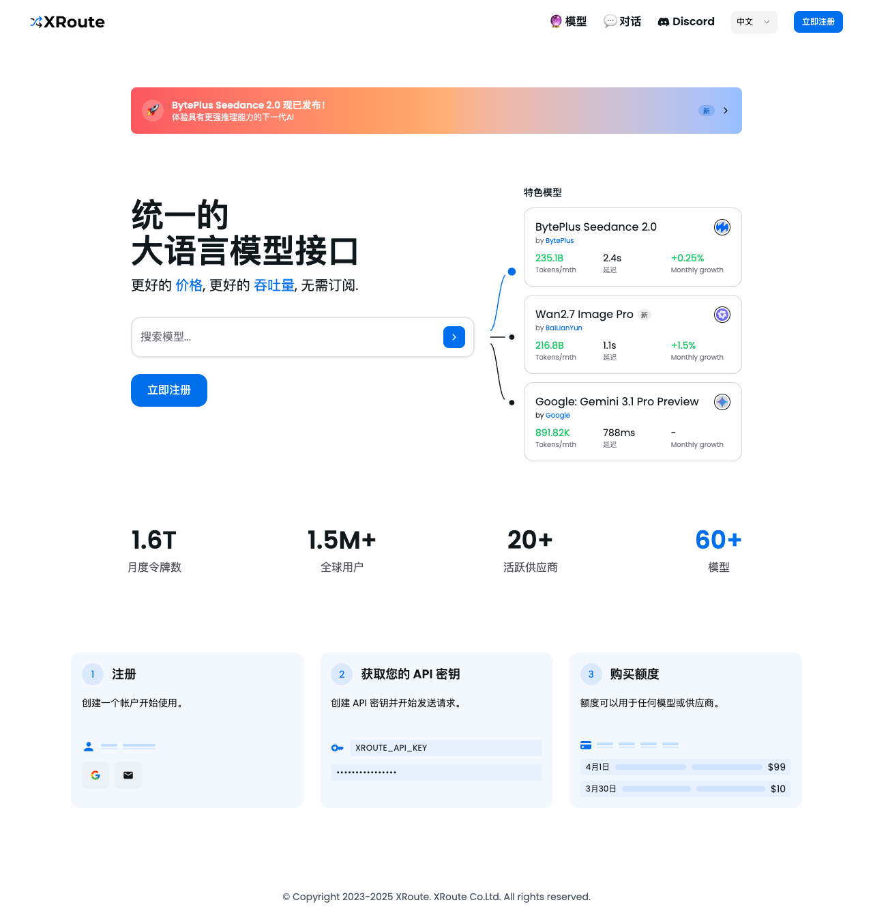

在 XRoute 首页右上角，点击蓝色的「立即注册」按钮。

### 第 2 步：输入邮箱地址

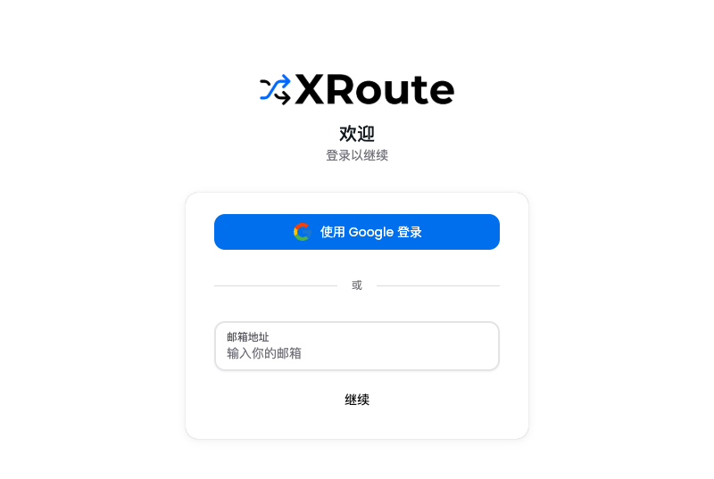

在注册页面，您可以选择：
- **使用 Google 登录** — 一键快捷登录
- **邮箱登录** — 输入邮箱地址后点击「继续」

### 第 3 步：填写邮箱

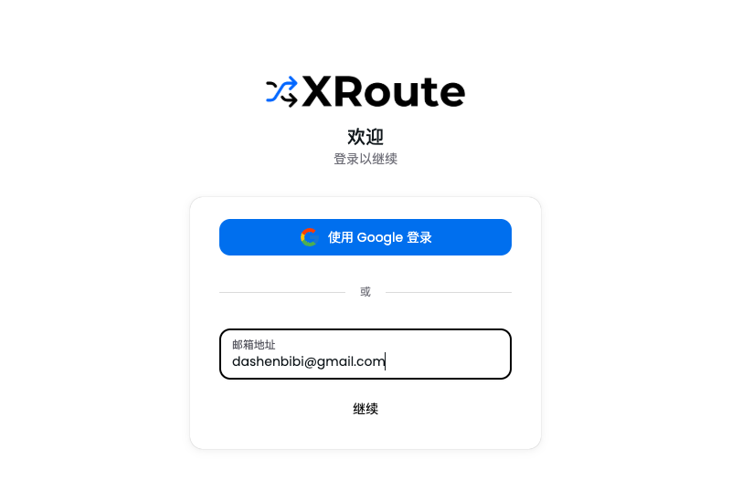

在输入框中填写您的邮箱地址，然后点击「继续」按钮。

### 第 4 步：输入验证码

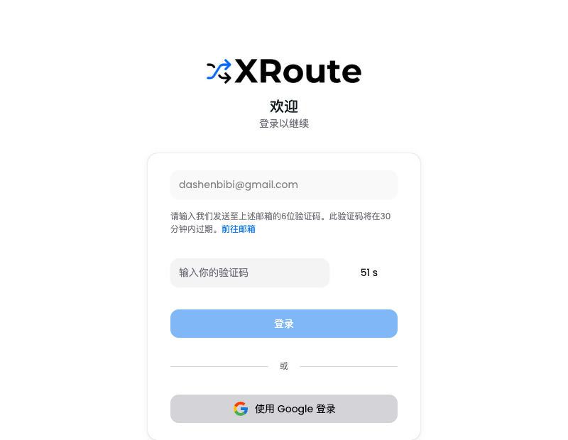

系统会向您的邮箱发送一个 6 位验证码，有效期 30 分钟。

### 第 5 步：完成注册

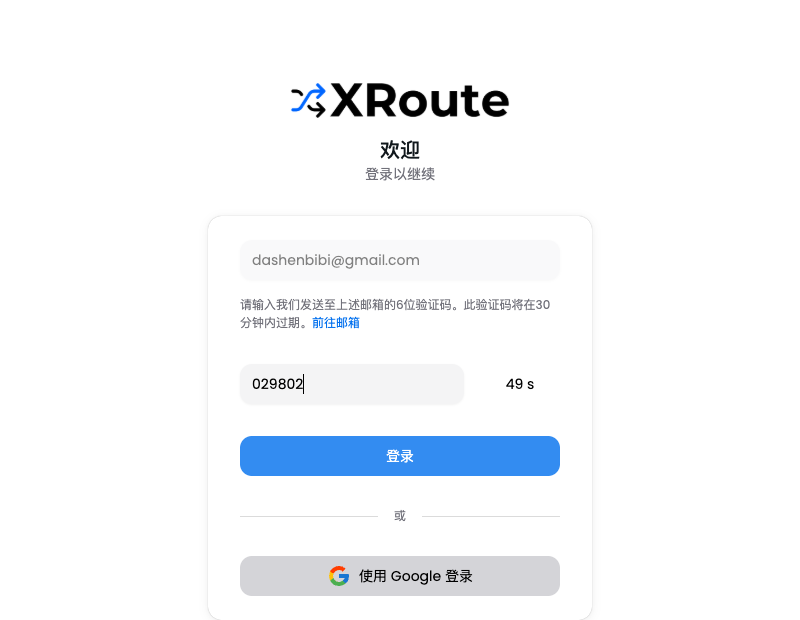

输入收到的验证码后，点击「登录」按钮完成注册。

---

## 2. 获取 API 密钥

### 第 1 步：进入控制台

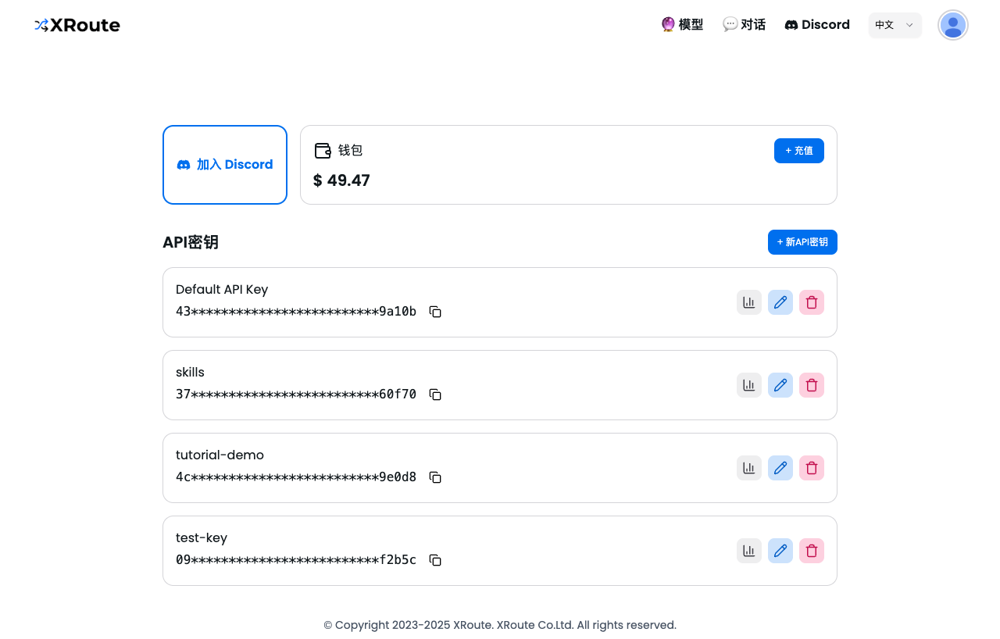

登录后自动进入控制台，这里可以管理您的 API 密钥和钱包余额。

### 第 2 步：创建新密钥

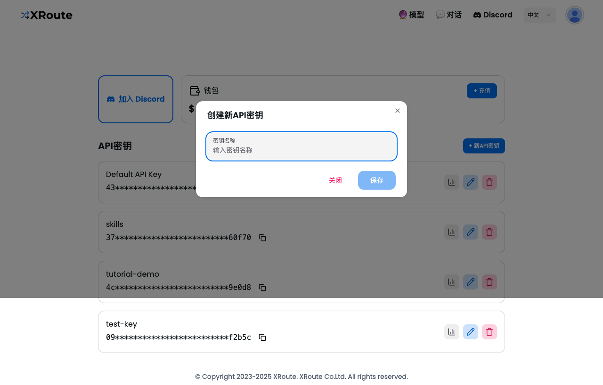

点击「+ 新API密钥」按钮，在弹出的对话框中输入密钥名称。

### 第 3 步：输入密钥名称

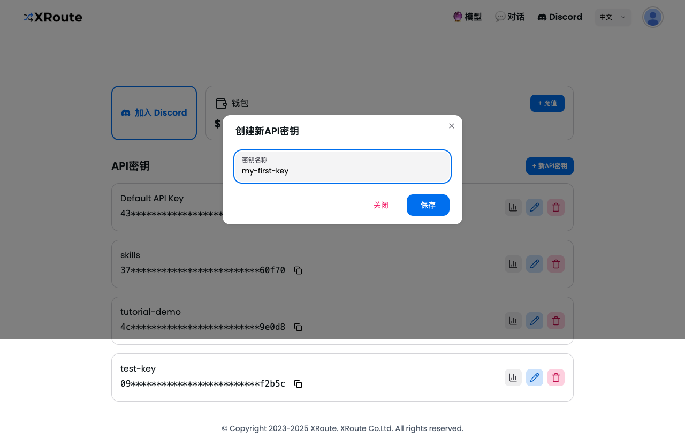

输入一个有意义的名称，比如「my-first-key」，然后点击「保存」按钮。

### 第 4 步：保存密钥

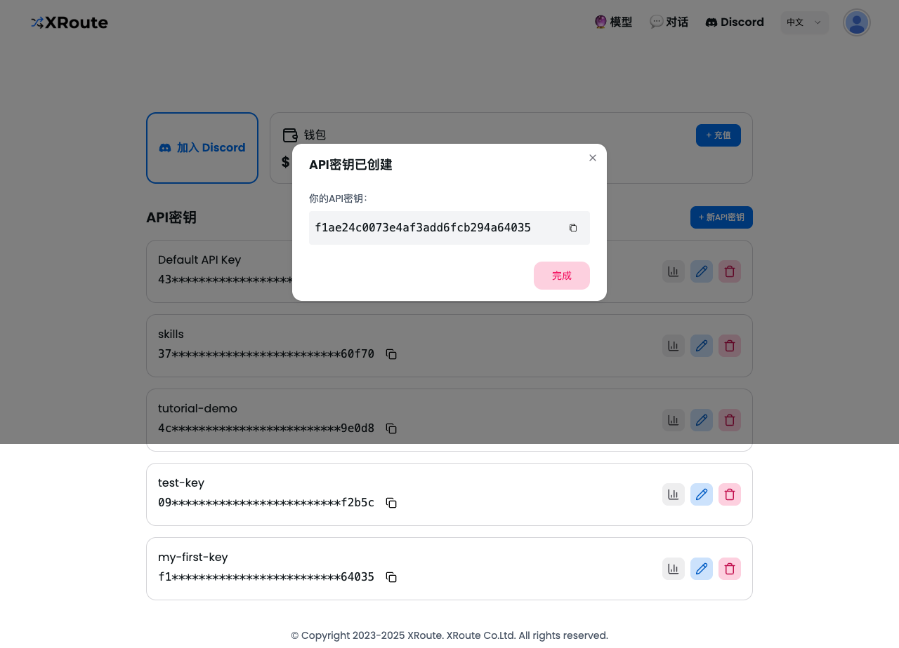

⚠️ **重要：** 请复制并保存好这个密钥，后续可以在密钥列表中随时复制使用。

### 第 5 步：密钥管理

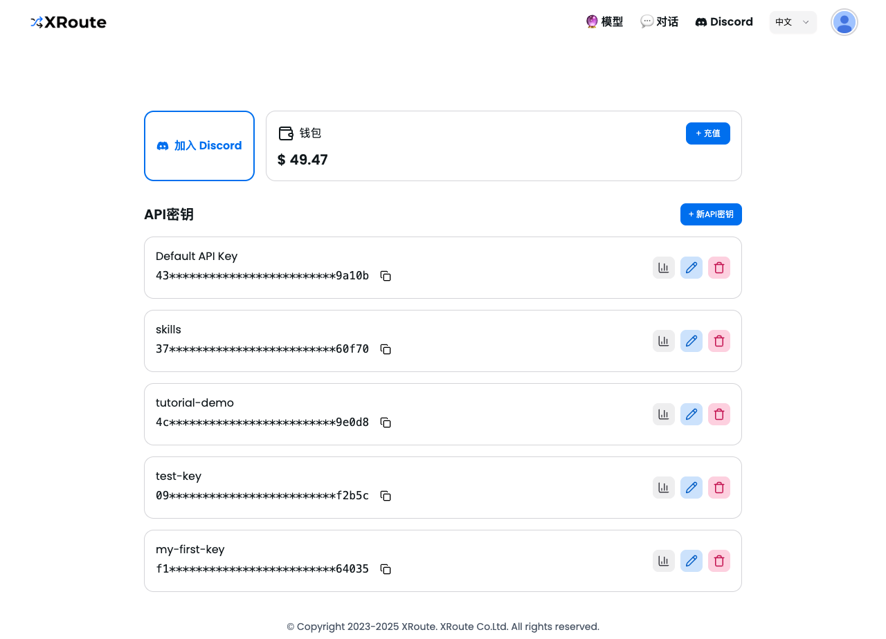

新创建的密钥会出现在列表中，您可以：
- 📊 查看使用统计
- ✏️ 编辑密钥名称
- 🗑️ 删除密钥

---

## 3. 购买额度

### 第 1 步：打开充值页面

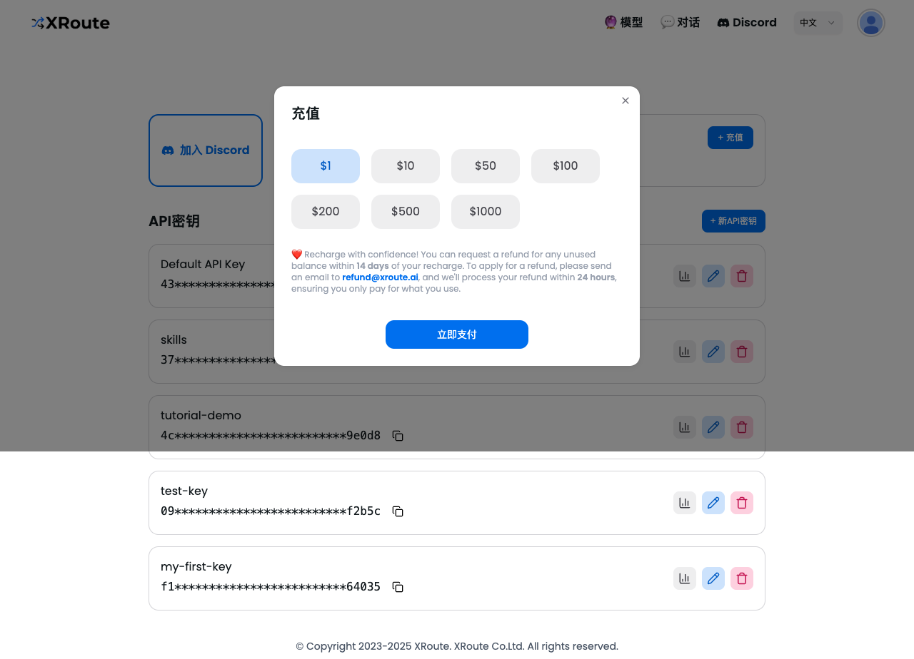

点击「+ 充值」按钮，选择充值金额。XRoute 提供多种预设金额：
$1 / $10 / $50 / $100 / $200 / $500 / $1000

❤️ 14 天内可退款，发送邮件到 refund@xroute.ai 即可。

### 第 2 步：选择支付方式

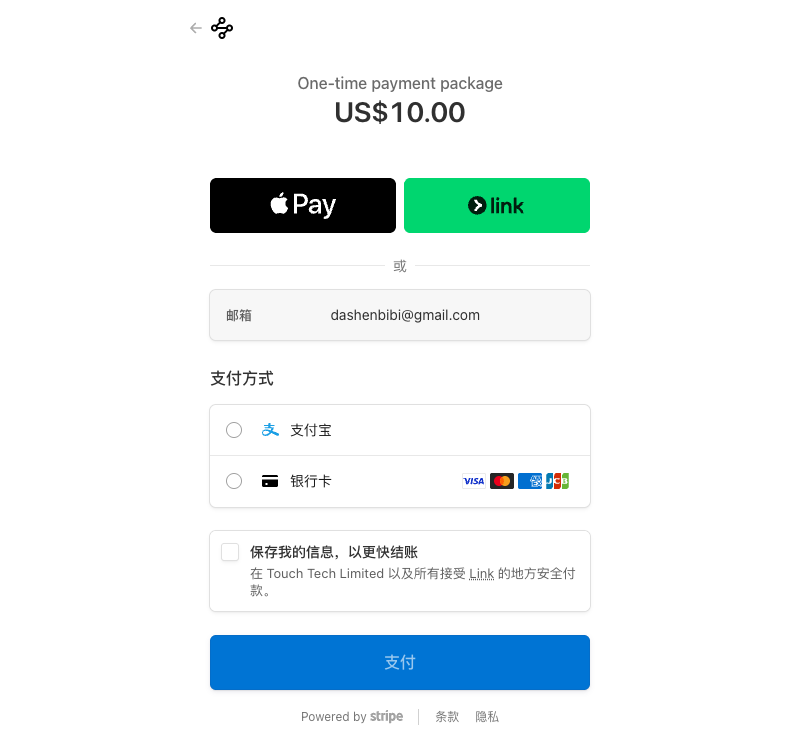

选择金额后点击「立即支付」，支持：
- **支付宝** — 适合国内用户
- **银行卡** — 支持 Visa、Mastercard、银联、JCB

---

## 4. 浏览模型

### 第 1 步：进入模型页面

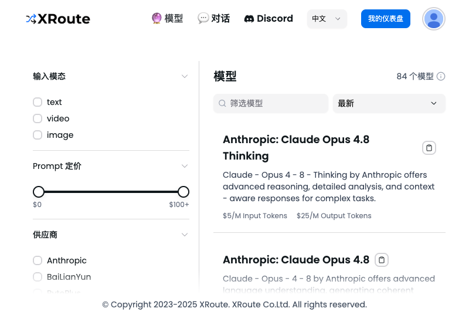

点击顶部导航的「模型」，可以看到 84 个可用模型。支持按以下条件筛选：
- **输入类型** — text / video / image
- **价格范围** — 滑块筛选
- **供应商** — Anthropic、Google、BytePlus 等
- **系列** — Claude、Gemini、Kimi 等

### 第 2 步：查看模型详情

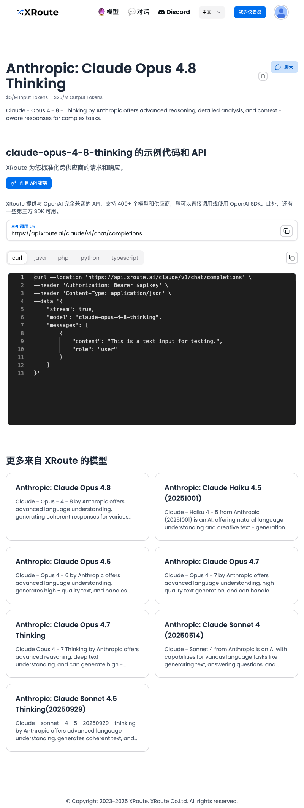

点击任意模型可以查看：
- 模型描述和能力
- 定价（输入/输出 Token 价格）
- API 调用地址
- 多语言代码示例（curl / Python / Java / PHP / TypeScript）

---

## 5. 对话功能

### 第 1 步：进入聊天页面

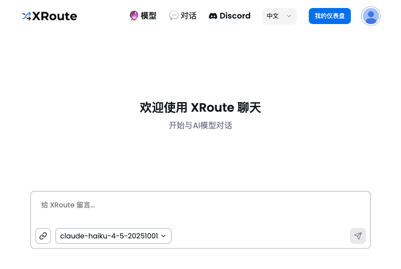

点击顶部导航的「对话」，进入聊天界面。

### 第 2 步：输入消息

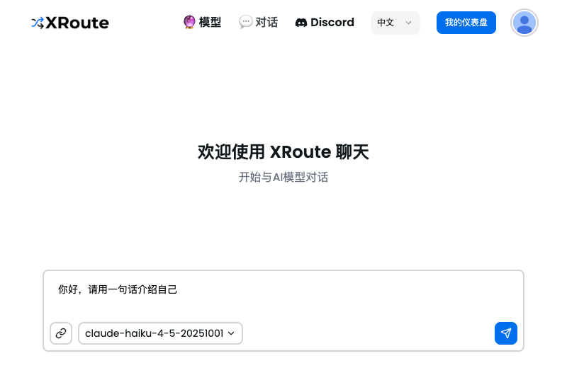

在输入框中输入消息，底部可以选择不同的 AI 模型。

### 第 3 步：发送并获取回复

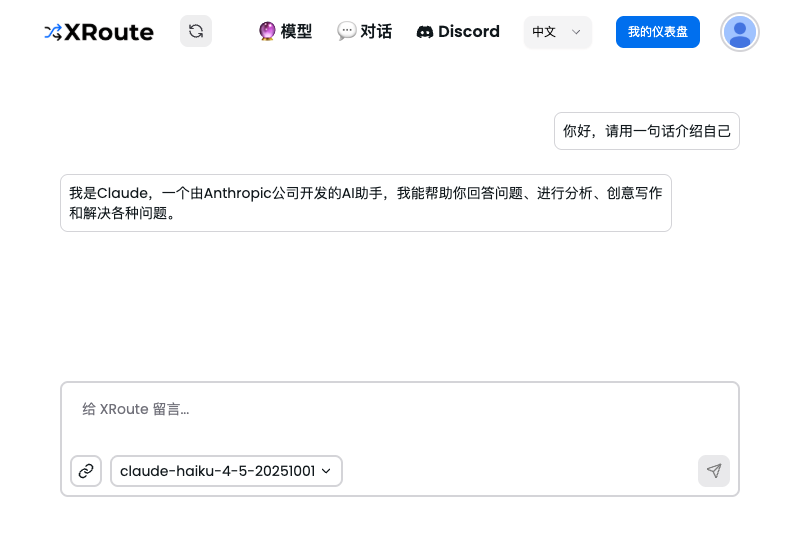

点击发送按钮，AI 会立即回复您的消息。您可以随时切换模型进行对话。

---

## 常见问题

**Q: API 密钥丢了怎么办？**
A: 可以在控制台删除旧密钥，创建新的密钥。

**Q: 充值后可以退款吗？**
A: 14 天内未使用的额度可以退款，发送邮件到 refund@xroute.ai。

**Q: 支持哪些 AI 模型？**
A: 支持 60+ 模型，包括 Claude、Gemini、Kimi、Kling 等。

**Q: 如何切换聊天模型？**
A: 在聊天页面底部的模型选择器中切换。

---

## 生成的文件

- 视频教程：`xroute-tutorial.mp4`（带旁白）
- 旁白音频：`narration.mp3`
- 字幕文件：`tutorial.srt`
- 本教程：`XRoute-tutorial.md`
